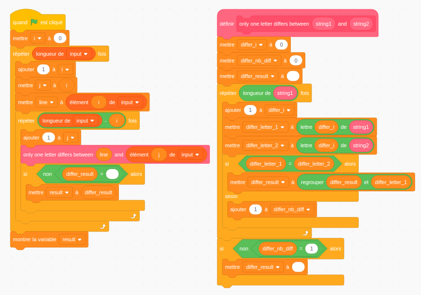

# Day 02: Inventory Management System

## Step 1

You stop falling through time, catch your breath, and check the screen on the device. "Destination reached. Current Year: 1518. Current Location: North Pole Utility Closet 83N10." You made it! Now, to find those anomalies.

Outside the utility closet, you hear footsteps and a voice. "...I'm not sure either. But now that so many people have chimneys, maybe he could sneak in that way?" Another voice responds, "Actually, we've been working on a new kind of **suit** that would let him fit through tight spaces like that. But, I heard that a few days ago, they lost the prototype fabric, the design plans, everything! Nobody on the team can even seem to remember important details of the project!"

"Wouldn't they have had enough fabric to fill several boxes in the warehouse? They'd be stored together, so the box IDs should be similar. Too bad it would take forever to search the warehouse for **two similar box IDs...**" They walk too far away to hear any more.

Late at night, you sneak to the warehouse - who knows what kinds of paradoxes you could cause if you were discovered - and use your fancy wrist device to quickly scan every box and produce a list of the likely candidates (your puzzle input).

To make sure you didn't miss any, you scan the likely candidate boxes again, counting the number that have an ID containing `exactly two of any letter` and then separately counting those with `exactly three of any letter`. You can multiply those two counts together to get a rudimentary _checksum_ and compare it to what your device predicts.

For example, if you see the following box IDs:

- `abcdef` contains no letters that appear exactly two or three times.
- `bababc` contains two `a` and three `b`, so it counts for both.
- `abbcde` contains two `b`, but no letter appears exactly three times.
- `abcccd` contains three `c`, but no letter appears exactly two times.
- `aabcdd` contains two `a` and two `d`, but it only counts once.
- `abcdee` contains two `e`.
- `ababab` contains three `a` and three `b`, but it only counts once.

Of these box IDs, four of them contain a letter which appears exactly twice, and three of them contain a letter which appears exactly three times. Multiplying these together produces a checksum of `4 * 3 = 12`.

**What is the checksum** for your list of box IDs?


### The solution

It looks like this:


## Part Two

Confident that your list of box IDs is complete, you're ready to find the boxes full of prototype fabric.

The boxes will have IDs which differ by exactly one character at the same position in both strings. For example, given the following box IDs:
```
abcde
fghij
klmno
pqrst
fguij
axcye
wvxyz
```

The IDs `abcde` and `axcye` are close, but they differ by two characters (the second and fourth). However, the IDs `fghij` and `fguij` differ by exactly one character, the third (`h` and `u`). Those must be the correct boxes.

**What letters are common between the two correct box IDs?** (In the example above, this is found by removing the differing character from either ID, producing `fgij`.)


### Solution

It looks like this:



## How to run

- Visiter https://beta.scratch.mit.edu/
- Cliquer sur `Fichier` > `Importer depuis votre ordinateur`
- Selectionner le fichier `scratch-project.sb3`
- Le résultat s'affiche à coté du petit chat (dans la variable result)
- Miaouu !


## Feedback

- C'était rigolo
- Langage ultra simpliste et accessible
- Agréablement surpris par les possibilités infinies du langage
- Dommage pour le scope des variables, elles me semblent toutes gloables
